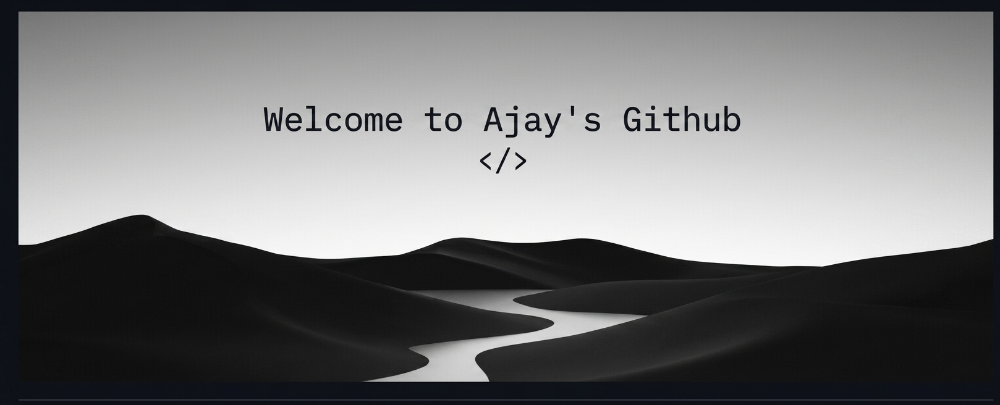

 

## 👋🏻 About Me

  

### Hi, I'm Ajay 🧑🏻‍💻

  I'm an aspiring Full-Stack Developer with knowledge of the MERN stack and currently learning Java Full-Stack Development and Data Structures & Algorithms (DSA). I enjoy building web applications, exploring modern technologies, and improving my problem-solving skills through continuous learning and hands-on projects. I'm passionate about creating efficient, user-friendly solutions and growing as a software developer.

 

- 📍 Pune, Maharashtra, India
- 💼 Open to **Internships & Freelance**
- 📫 Reach me at **ajayrmali2003@gmail.com**
  
   

 >*Code is not just syntax — it's the solution to real problems.*

 

---

## 🛠️ Tech Stack

**Tools**

---

## 📫 Connect With Me

